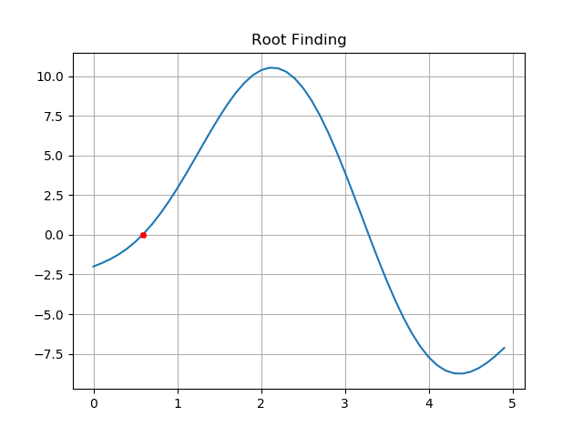
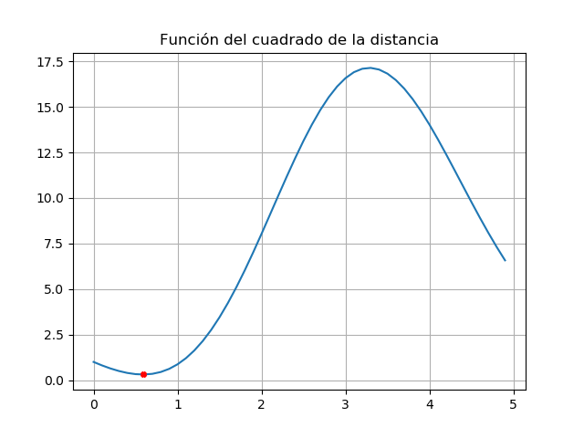

# Primer Taller Análisis Numérico.

## Punto 1. 
Evaluar el polinomio en cada valor indicado y el número de operaciones mínimo para hacerlo, para los siguientes polinomios junto con sus derivadas.

<a href="https://www.codecogs.com/eqnedit.php?latex=P(x)=7x^{5}+6x^{4}-6x^{3}+3x-4" target="_blank"></a>

<a href="https://www.codecogs.com/eqnedit.php?latex=x0=3" target="_blank"></a>

A través de la implementación del método de horner en Python, se obtuvieron los siguientes resutados.

Con <a href="https://www.codecogs.com/eqnedit.php?latex=x0=3" target="_blank"></a>

Para el polinomio: <a href="https://www.codecogs.com/eqnedit.php?latex=P(x)=7x^{5}+6x^{4}-6x^{3}+3x-4" target="_blank"></a>

Se obtuvo como resultado: 2030 y como mínimo número de operaciones: 10

Para la primera derivada: <a href="https://www.codecogs.com/eqnedit.php?latex=P'(x)=35x^4+24x^3-18x^2+3" target="_blank"></a>

Se obtuvo como resultado: 3324 y como mínimo número de operaciones: 8

Para la segunda derivada: <a href="https://www.codecogs.com/eqnedit.php?latex=P''(x)=140x^3+72x^2-36x" target="_blank"></a>

Se obtuvo como resultado: 4320 y como mínimo número de operaciones: 6

Para la tercera derivada: <a href="https://www.codecogs.com/eqnedit.php?latex=P'''(x)=420x^2+144x-36" target="_blank"></a>

Se obtuvo como resultado: 4176 y como mínimo número de operaciones: 4

Para la cuarta derivada: <a href="https://www.codecogs.com/eqnedit.php?latex=P''''(x)=840x+144" target="_blank"></a>

Se obtuvo como resultado: 2664 y como mínimo número de operaciones: 2

## Punto 2. 

Se necesita un recipiente rectangular, sin tapa, de un litro de capacidad. Para construirlo se debe usar una lámina rectangular de 32 cm de largo y 24 cm de ancho. El procedimiento será recortar un cuadrado idéntico en cada una de las cuatro esquinas y doblar los bordes de la lámina para formar el recipiente. 

El código determina la medida del lado del cuadrado que se debe recortar en cada esquina para que el recipiente tenga la capacidad requerida. 

**Solución:** 

Un esquema del problema es como el que se muestra en la figura a continuación: 

<p align="center">
  
</p>

El volumen de la caja se puede obtener mediante la siguiente expresión:

<a href="https://www.codecogs.com/eqnedit.php?latex=V(x)=x(0.24-x)(0.32-x)" target="_blank"></a>

Luego, basta con resolver la siguiente ecuación: 

<a href="https://www.codecogs.com/eqnedit.php?latex=V(x)=x(0.24-x)(0.32-x)" target="_blank"></a>

Para resolver el problema, se debe tener en cuenta que el volumen solamente puede aproximarse por la izquierda al valor equivalente a un litro, para eso se le restará un valor de épsilon que permita aproximarse a la solución por la izquierda, resolvimos el problema mediante el método de Bisecciones y Newton Raphson. 

**Resultados:** 

```
Intervalo: [0,0.05]

 x  = 0.016962500000000012
Vol = 0.0009999886616640628

Intervalo: [0.05,0.1]

 x  = 0.0809325
Vol = 0.0009999921144448125

Intervalo: [0.1,0.15]

 x  = 0.18210500000000004
Vol = 0.0009999975752305029

```
Graficamente: 

**Preguntas Adicionales:**

1. ¿Cuál etapa del proceso de resolución de un problema numérico requiere más atención? 

Para solucionar un problema matemático es necesario que todas las etapas del proceso se lleven acabo de manera correcta, sin embargo la formulación matemática inicial es lo más importante. Si la ecuación planteada no es correcta, ningún método numérico por bueno que sea, puede corregir los problemas en el modelo analítico del problema. 

2. ¿Qué conocimientos son necesarios para formular un modelo matemático? 

Depende mucho del problema en cuestión, sin embargo, de manera muy general se necesitan conocimientos de cálculo multivariado, álgebra lineal y ecuaciones diferenciales.  

3. En el ejemplo anterior. ¿Cuál sería la desventaja de intentar obtener experimentalmente la solución mediante prueba y error en lugar de analizar el modelo matemático? 

En caso de que solo se cuente con una lámina, si se falla no hay forma de corregir. En este caso sería un método de acierto o error. 

4. ¿Qué es más crítico: el error de truncamiento o el error de redondeo?

Cuando se redondea, se tienen en cuenta algunas de las cifras que se dejan de lado, sin embargo, cuando se trunca el valor no se consieran las cifras dejadas de lado. Desde esa perspectiva, es más crítico el error de truncamiento. 

5. ¿Cuál es la ventaja de instrumentar computacionalmente un método numérico?
Por que los computadores permiten realizar los procesos iterativos con mucha facilidad, además, como los algoritmos son generales, basta con programarlos una sola vez para aplicarlos en diferentes contextos. 

6. ¿Por qué es importante validar los resultados obtenidos? 

Por que, aun cuando la formulación matemática del problema haya sido correcta, es posible que los métodos numéricos converjan a una solución que no sea correcta.  


## Punto 3 o 4 o 5.  

## Punto 6. 
Eficiencia de un algoritmo esta denotada por T(n)
 
 Al momento de recorrer el algoritmo con n = 73, se realizaron 7 operaciones aritméticas de división.
 
 Ya con <a href="https://www.codecogs.com/eqnedit.php?latex=T(n)" target="_blank"></a> encontrado que es igual a 7, se expresa a O( ) como <a href="https://www.codecogs.com/eqnedit.php?latex=O(2^{-n})" target="_blank"></a>
 
## Punto 7.  
Una partícula se mueve en el espacio con el siguiente vector posición: 

<a href="https://www.codecogs.com/eqnedit.php?latex=R(t)=(2\cos&space;(t),2\sin(t),0)" target="_blank"></a>

Se quiere conocer utilizando métodos numéricos, el tiempo en el que el objeto se encuentre más cercano del punto <a href="https://www.codecogs.com/eqnedit.php?latex=P(2,1,0)" target="_blank"></a> . Se utilizará el método de Newton Rapson, usando 4 decimales de precisión. 

**Solución:** 

En primer lugar es necesario plantear la solución analítica del problema, lo que permitirá obtener la expresión que deberá ser resuelta usando métodos numéricos. Para esto, usando los conocimientos de cálculo de una variable, definimos la distancia de la partícula al punto P, como función del tiempo: 

<a href="https://www.codecogs.com/eqnedit.php?latex=d(t)=((2\cos(t)-2)^{2}&plus;(2\sin(t)-1)^{2})^{1/2}" target="_blank"></a>

Lo que buscamos es minimizar esta función, pero basta con minimizar su cuadrado. Para esto, derivamos su cuadrado e igualamos la derivada a cero, obtieniendo la ecuación que deberá ser resuelta utilizando el método de Newton.

<a href="https://www.codecogs.com/eqnedit.php?latex=D'(t)=-4(2\cos(t)-2)\sin(t)&plus;2(\sin(t)-1)\cost(t)" target="_blank"></a>

<a href="https://www.codecogs.com/eqnedit.php?latex=D'(t)=-6\sin(2t)&plus;2\sin(t)&plus;8\cost(t)" target="_blank"></a>

Utilizando el método de Newton: 


Resultados: 

```
 t = Lower Limit 
 r = Upper Limit.  
 
```

Gráficamente, podemos verificar tanto la validez como la convergencia del método. 

<p align="center">
  
</p>

<p align="center">
  
</p>


## Punto 10.

Se utilizará el método de Newton para encontrar una intersección de las siguientes ecuaciones en coordenadas polares. 

<a href="https://www.codecogs.com/eqnedit.php?latex=r=2&plus;\cos&space;(3t)" target="_blank"></a>

<a href="https://www.codecogs.com/eqnedit.php?latex=r=2-e^{t}" target="_blank"></a>

**Solución:** 
                                                                                              
Se igualan las dos ecuaciones y se obtiene la siguiente expresión. 

<a href="https://www.codecogs.com/eqnedit.php?latex=r=2-e^{t}" target="_blank"></a>

Utilizando el método de Newton: 

Se selecciona una solución en el siguiente intervalo: 

```
a = Lower Limit 
b := Upper Limit.  
tol := Desired Tolerance of the Answer. 
```

Resultados: 

```
 t = Lower Limit 
 r = Upper Limit.  
 
```

Gráficamente, podemos verificar la validez de la solución. 


## Punto 14. 

## Punto 15. 

Se propone resolver la integral <a href="https://www.codecogs.com/eqnedit.php?latex=\int_{0}^{x}&space;\left&space;(&space;5&space;-&space;e^{u}&space;\right&space;)&space;du" target="_blank"></a> con el método del punto fijo. 

Al resolver la integral, la expresión puede reescribirse como:

<a href="https://www.codecogs.com/eqnedit.php?latex=f(x)=5x-e^{x}-1=0" target="_blank"></a>

Gráficamente, el posible dar un estimado de las raices reales de la expresión: 

Nuevamenta, la expresión puede reescribirse como: 

<a href="https://www.codecogs.com/eqnedit.php?latex=x=\frac{1&plus;e^{x}}{5}" target="_blank"></a>

Utilizaremos el método del punto fijo para solucionar la expresión, encontreremos una solución en el intervalo

Resultados: 


