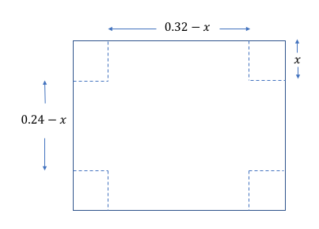

# Primer Taller Análisis Numérico.

## Punto 1. 


## Punto 2. 

Se necesita un recipiente rectangular, sin tapa, de un litro de capacidad. Para construirlo se debe usar una lámina rectangular de 32 cm de largo y 24 cm de ancho. El procedimiento será recortar un cuadrado idéntico en cada una de las cuatro esquinas y doblar los bordes de la lámina para formar el recipiente. 

El código determina la medida del lado del cuadrado que se debe recortar en cada esquina para que el recipiente tenga la capacidad requerida. 

**Solución:** 

Un esquema del problema es como el que se muestra en la figura a continuación: 

<p align="center">
  
</p>

El volumen de la caja se puede obtener mediante la siguiente expresión:

<a href="https://www.codecogs.com/eqnedit.php?latex=V(x)=x(0.24-x)(0.32-x)" target="_blank"></a>

Luego, basta con resolver la siguiente ecuación: 

<a href="https://www.codecogs.com/eqnedit.php?latex=V(x)=x(0.24-x)(0.32-x)" target="_blank"></a>

Para resolver el problema usamos una variación de los métodos de bisecciones y Newton Rapson que permita aproximarse a la solución por la izquierda.

## Punto 3 o 4 o 5.  

## Punto 6. 
 
## Punto 7.  
Una partícula se mueve en el espacio con el siguiente vector posición: 

<a href="https://www.codecogs.com/eqnedit.php?latex=R(t)=(2\cos&space;(t),2\sin(t),0)" target="_blank"></a>

Se quiere conocer utilizando métodos numéricos, el tiempo en el que el objeto se encuentre más cercano del punto <a href="https://www.codecogs.com/eqnedit.php?latex=P(2,1,0)" target="_blank"></a> . Se utilizará el método de Newton Rapson, usando 4 decimales de precisión. 

**Solución:** 

En primer lugar es necesario plantear la solución analítica del problema, lo que permitirá obtener la expresión que deberá ser resuelta usando métodos numéricos. Para esto, usando los conocimientos de cálculo de una variable, definimos la distancia de la partícula al punto P, como función del tiempo: 

<a href="https://www.codecogs.com/eqnedit.php?latex=d(t)=((2\cos(t)-2)^{2}&plus;(2\sin(t)-1)^{2})^{1/2}" target="_blank"></a>

Lo que buscamos es minimizar esta función, pero basta con minimizar su cuadrado. Para esto, derivamos su cuadrado e igualamos la derivada a cero, obtieniendo la ecuación que deberá ser resuelta utilizando el método e Newton. 


Gráficamente, podemos verificar tanto la validez como la convergencia del método. 


## Punto 10.

Se utilizará el método de Newton para encontrar una intersección de las siguientes ecuaciones en coordenadas polares. 

<a href="https://www.codecogs.com/eqnedit.php?latex=r=2&plus;\cos&space;(3t)" target="_blank"></a>

<a href="https://www.codecogs.com/eqnedit.php?latex=r=2-e^{t}" target="_blank"></a>

**Solución:** 
                                                                                              
Se igualan las dos ecuaciones y se obtiene la siguiente expresión. 


Para utilizar el método de Newton, derivamos la expresión: 

Se selecciona una solución en el siguiente intervalo: 

```
a = Lower Limit 
b := Upper Limit.  
tol := Desired Tolerance of the Answer. 
```

## Punto 14. 

## Punto 15. 

Se propone resolver la integral con el método del punto fijo: 

<a href="https://www.codecogs.com/eqnedit.php?latex=\int_{0}^{x}&space;\left&space;(&space;5&space;-&space;e^{u}&space;\right&space;)&space;du" target="_blank"></a>


