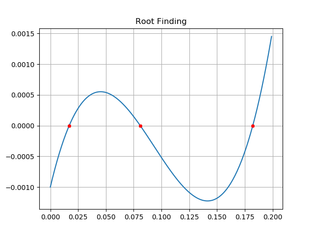

# N-Seccions
Code for finding the root of a function using a generalization of Bisections Method.

You need to specify the Interval that might contain the root of the function, the number of sub-intervals you want to consider in each iteration and the desired tolerance of the answer. 

```
a := Lower Limit 
b := Upper Limit. 
n := Number of Divisions. 
tol := Desired Tolerance of the Answer. 
```

These are some of the results that can be obtained with the algorithm for differentc combiantions of functions and parameters:


```
a = -8; b =5 ; n=5  tol=1e-8
```

<p align="center">
  
</p>


```
a = -8; b =5 ; n=5  tol=1e-8
```

<p align="center">
  
</p>


